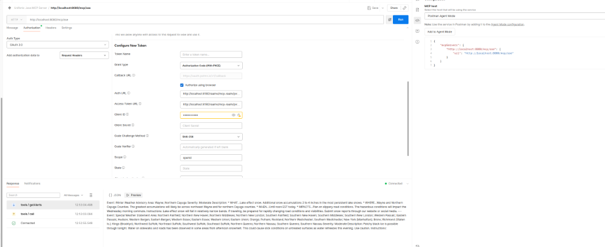
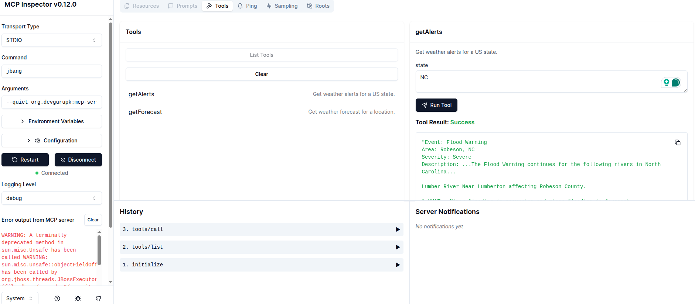

# Weather MCP Server
A Quarkus-based Model Context Protocol (MCP) server that provides weather information using the National Weather Service API.
## What is Model Context Protocol (MCP)?
Model Context Protocol (MCP) is a standardized protocol that allows AI models to discover and use external tools. This project implements an MCP server that provides weather forecast and alert tools that can be called by AI models or other MCP clients.
The server uses the Quarkiverse MCP Server extension to expose tools as a standard MCP API, making it easier for AI systems to access real-time weather data.
## Weather Tools Provided
This server provides two main tools:
1. **getAlerts** - Retrieves active weather alerts for a specified US state
``` json
   {
     "name": "getAlerts",
     "arguments": {
       "state": "CA"  // Two-letter US state code
     }
   }
```
1. **getForecast** - Retrieves weather forecast for a geographic location
``` json
   {
     "name": "getForecast",
     "arguments": {
       "latitude": 37.7749,  // Latitude coordinate
       "longitude": -122.4194  // Longitude coordinate
     }
   }
```
## Project Structure
- Main class containing tool definitions using annotations `Weather.java``@Tool`
- REST client to communicate with the National Weather Service API `WeatherClient.java`
- Formats the raw API responses into human-readable text `WeatherFormatter.java`
- Model classes for API responses (Alerts, Forecast, etc.)

## Getting Started
### Prerequisites
- Java 24 or newer
- Maven (for building)
- JBang (for running with MCP Inspector)
- Node.js with npm (for the MCP Inspector)

### Running with Maven
``` shell
# Build and package as uber-jar
./mvnw package
java -jar target/mcp-server-1.0.0-SNAPSHOT-runner.jar
```
### Running with JBang
This project is configured to work with JBang for easy execution. The application.properties includes configuration to build an uber-jar that can be run with JBang:
``` shell
# Build the uber-jar
./mvnw package

# Run with JBang
jbang org.devgurupk:mcp-server:1.0.0-SNAPSHOT:runner
```
## Authentication (OAuth 2.1)

This MCP server is secured using **OAuth 2.1** with Keycloak as the identity provider. It supports both **static clients** (like Postman) and **Dynamic Client Registration** (for tools like JetBrains AI Assistant).

### Quick Setup

1. **Start Keycloak:**
   ```bash
   docker compose up -d
   ```

2. **Start the MCP Server:**
   ```bash
   mvn quarkus:dev
   ```

3. **Keycloak Admin:** http://localhost:8180 (admin/admin)

### Test User Credentials
- Username: `testuser`
- Password: `password`

### Dynamic Client Registration (DCR)

This server supports OAuth 2.0 Dynamic Client Registration, enabling MCP clients like **JetBrains AI Assistant** and **Claude Desktop** to automatically register themselves with Keycloak.

**Tested with:**
- ✅ JetBrains AI Assistant (Antigravity)
- ✅ MCP Inspector
- ✅ Postman

#### How DCR Works
1. The MCP client discovers the authorization server via `/.well-known/oauth-protected-resource`
2. Client dynamically registers with Keycloak (no manual client setup needed)
3. User authenticates via Keycloak login
4. Token is validated locally by the Quarkus server

## Testing with Postman (OAuth 2.0)

Configure Postman's Authorization tab with these settings:

| Setting | Value |
|---------|-------|
| Type | OAuth 2.0 |
| Grant Type | Authorization Code (With PKCE) |
| Auth URL | `http://localhost:8180/realms/mcp-realm/protocol/openid-connect/auth` |
| Token URL | `http://localhost:8180/realms/mcp-realm/protocol/openid-connect/token` |
| Client ID | `mcp-server` |
| Code Challenge Method | SHA-256 |
| Scope | `openid` |



**Steps:**
1. Click **Get New Access Token**
2. Login with `testuser` / `password`
3. Click **Use Token**
4. Connect to `http://localhost:8080/mcp/sse`

## Testing with MCP Inspector
You can use the Model Context Protocol Inspector to test and interact with the MCP server:
``` shell
  npx @modelcontextprotocol/inspector
```

Add this to arguments:
`--quiet org.devgurupk:mcp-server:1.0.0-SNAPSHOT:runner`

By default, the server exposes the MCP endpoint at the path `/mcp`, as configured in `application.properties`:
``` properties
quarkus.mcp.server.sse.root-path=/mcp
```
## Configuration Options
The application.properties file contains important configurations:
``` properties
# Follow redirects from the weather API
quarkus.rest-client.follow-redirects=true

# Package as uber-jar for JBang compatibility
quarkus.package.jar.type=uber-jar

# Logging configuration
quarkus.log.file.enable=true
quarkus.log.file.path=weather-quarkus.log

# MCP server configuration
quarkus.mcp.server.sse.root-path=/mcp
```
Uncomment the debugging options in application.properties if you need more detailed logs:
``` properties
# Debug logging options
#quarkus.log.level=DEBUG
#quarkus.mcp.server.traffic-logging.enabled=true
#quarkus.mcp.server.traffic-logging.text-limit=100
```
## Technical Details
- **Framework**: Quarkus 3.22.3
- **Java Version**: Java 23
- **MCP Implementation**: Quarkiverse MCP Server 1.0.0
- **API Source**: National Weather Service (api.weather.gov)
- **Key Libraries**:
    - Quarkus REST Client with Jackson
    - Quarkus Qute templating
    - Quarkiverse MCP Server (StdIO mode)

## Building for Production
### Uber-JAR (Recommended for JBang)
``` shell
./mvnw package -Dquarkus.package.jar.type=uber-jar
```
The uber-jar is created at `target/mcp-server-1.0.0-SNAPSHOT-runner.jar`
### Native Executable (Optional)
``` shell
# Native build with GraalVM installed
./mvnw package -Dnative

# Or using containers if GraalVM is not installed
./mvnw package -Dnative -Dquarkus.native.container-build=true
```
## How It Works
The project uses the Model Context Protocol to expose weather data tools:
1. The annotation in marks methods as tools available through the MCP API `@Tool``Weather.java`
2. The annotation describes the parameters that each tool requires `@ToolArg`
3. The interfaces with the National Weather Service API `WeatherClient`
4. The class formats the responses for human readability `WeatherFormatter`
5. The Quarkus MCP Server extension provides the server implementation that allows tools to be discovered and used by MCP clients

When an MCP client like the Inspector connects, it receives a list of available tools with their descriptions and can then invoke them by name with the appropriate arguments.

